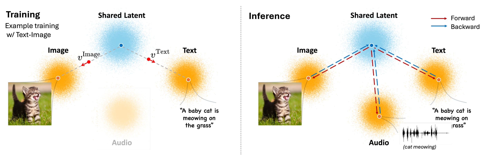

# FlowBind: Efficient Any-to-Any Generation with Bidirectional Flows

<div align="center">

[**Yeonwoo Cha**\*](https://yeonwoo378.github.io), [**Semin Kim**\*](https://seminkim.github.io), [**Jinhyeon Kwon**](https://github.com/jinhyeonkwon), [**Seunghoon Hong**](https://maga33.github.io)<br>
KAIST

[**[Paper]**](https://arxiv.org/abs/xxxx.xxxxx) | [**[Project Page]**](https://yeonwoo378.github.io/FlowBind2026) | [**[HuggingFace]**](https://huggingface.co/yeonwoo378/flowbind)

</div>

<br>



## Introduction

> **TL;DR:**  FlowBind utilizes bidirectional flows to achieve efficient, any-to-any multimodal generation.

We propose **FlowBind**, an efficient framework for any-to-any generation. Our approach is distinguished by its simplicity: it learns a shared latent space capturing cross-modal information, with modality-specific invertible flows bridging this latent to each modality. Both components are optimized jointly under a single flow-matching objective, and at inference the invertible flows act as encoders and decoders for direct translation across modalities. By factorizing interactions through the shared latent, FlowBind naturally leverages arbitrary subsets of modalities for training, and achieves competitive generation quality while substantially reducing data requirements and computational cost. 


---

## Installation


We recommend using Docker to ensure environment consistency. Alternatively, you can set up the environment manually by installing the dependencies listed in `requirements.txt`.

1. Docker Setup
```bash
docker pull yeonwoo378/flowbind:latest
docker run -it yeonwoo378/flowbind:latest bash
```
2.  Clone the repository
```bash
git clone https://github.com/yeonwoo378/flowbind.git
cd flowbind
```
3. Install Requirements
```bash
pip install -r requirements.txt
```

---

## Inference

We provide a Jupyter notebook to guide you through the inference process, including loading pretrained weights and running generation tasks.

Please refer to **[`demo.ipynb`](demo.ipynb)** for a step-by-step tutorial.

---

## Data Preparation

We utilize the following datasets for training and evaluation.

* **Text-Image:**
    * [**LAION-COCO**](https://huggingface.co/datasets/guangyil/laion-coco-aesthetic) (Filtered by aesthetic scores)
    * [**Flickr30k**](https://huggingface.co/datasets/nlphuji/flickr30k)
* **Text-Audio:**
    * [**AudioCaps**](https://github.com/cdjkim/audiocaps) 
* **Audio-Image:**
    * [**VGGSound**](https://huggingface.co/datasets/Loie/VGGSound/tree/main)

**Note:** Due to copyright and licensing restrictions, we cannot provide the raw training datasets directly. Please download the data from the official links provided above.

Before training, you must extract features from your dataset (e.g., Flickr30k).

```bash
# Extract features for Text-to-Image (T2I) tasks
python extract_data/extract_t2i.py \
    --dataset flickr30k \
    --data_root /path/to/your/data
```
Extracted training features will be automatically saved to `./feats/{dataset_name}`

---

## Training

You can train the model using `torchrun` for distributed training. The command below demonstrates how to launch training on a single node with 4 GPUs.

```bash
torchrun --nnodes=1 --nproc_per_node=4 main.py \
    --exp_name flowbind_exp \
    --batch_size 256 \
    --dataset audiocaps flickr30k laion vggsound \
    --t_cond adaln \
    --hidden_dim 1152 \
    --lr 1e-4
```
Training logs are automatically synced to Weights & Biases (WandB). Please ensure you are logged in via wandb login before starting the training.

---

## Acknowledgements

This repository is built upon the following open-source projects. We thank the authors for their excellent contributions.

* [**Flow Matching**](https://github.com/facebookresearch/flow_matching)
* [**DiT**](https://github.com/facebookresearch/DiT)
* [**AudioCaps**](https://github.com/cdjkim/audiocaps)
* [**CoDi**](https://github.com/microsoft/i-Code/tree/main/i-Code-V3)

---

## Citation

If you find our work helpful, please cite:

```bibtex
@article{cha2025flowbind,
  title={FlowBind: Efficient Any-to-Any Generation with Bidirectional Flows},
  author={Cha, Yeonwoo and Kim, Semin and Kwon, Jinhyeon and Hong, Seunghoon},
  journal={arXiv preprint arXiv:xxxx.xxxxx},
  year={2025}
}
```

---

## Contact
For any inquiries, please contact **Yeonwoo Cha** at `ckdusdn03@kaist.ac.kr`.